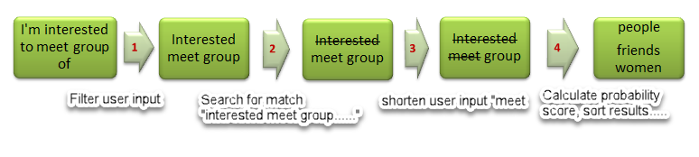
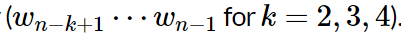
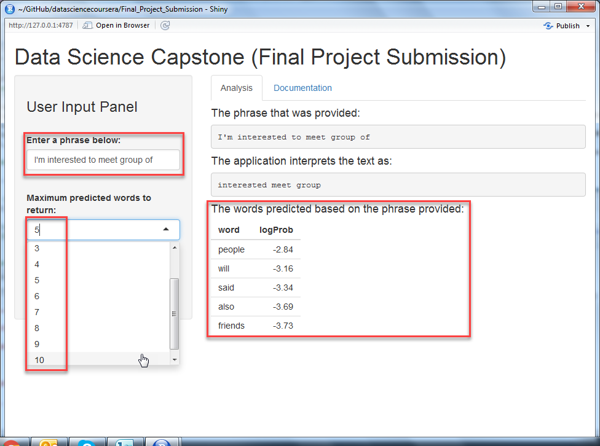

Data Science Capstone (Final Project Submission)
========================================================

    Muhammed Afifi Ibrahim 
    February 15, 2017
  

    Coursera Data Science Capstone Project
 

    Source code :[My Github](https://github.com/maibrahim2016/datasciencecoursera/Final_Project_Submission) 
    Shiny Apps  :[Prediction Words](https://maibrahim2016.shinyapps.io/Final_Project_Submission/) 
    R Pubs      :[Slide Deck](http://rpubs.com/maibrahim2016/Final_Project_Submission)
  

Project Assignment
========================================================

**Instructions**

  
    The goal of this exercise is to create a product to highlight the prediction             algorithm that you have built and to provide an interface that can be accessed by        others. For this project you must submit: 
   

  [1] A Shiny app that takes as input a phrase (multiple words) in a text box input and     outputs a prediction of the next word.
   

  [2] A slide deck consisting of no more than 5 slides created with **[R Studio      Presenter](https://support.rstudio.com/hc/en-us/articles/200486468-Authoring-R-Presentat   ions)** pitching your algorithm and app as if you were presenting to your boss or an      investor.
  
  

Algorithm Function - Flowchart
========================================================

**Word Prediction Flowchart**

  
    Functionality of the text prediction algorithm:
  
   
    
  
    Step 1: Remove punctuation, foreign characters, and profanity. 
    Step 2: Search for match, if matches are found, skip to Step 4. 
    Step 3: Shorten input, calculate a penalty value, search again. 
    Step 4: Calculate score for each match found, sort results.
  

Algorithm Function - Probability Model
========================================================

**Markov Assumption**

  
    The algorithm built for this project is based on the n-grams model with the Markov        assumption. This is due to the speed returning predicted words and memory restrictions     of the shinyApps website. In other words, we seek to find the word (Wn) which             maximizes the conditional probability of (Wn) given its history.
  

   

  
    If we use the "Stupid Backoff" to find more matches we apply a penalty to the log         probability score.
  

User Guideline & Conclusion
========================================================

**How to use the application?**

  

  

   
      [1] Enter the beginning of a sentence in the text area. 
      [2] Choose the predicted choices you wish to be display. 
      [3] Hit the "Analyze Text" button to display the sentence completion predicted. 
    
  

 
**Conclusions**

  
    The prediction accuracy of the model evaluated on an out-of-sample validation set is     approximately 20%. This is quite good for a model based only on n-grams, but some        improvements may be possible in the near future.
  

